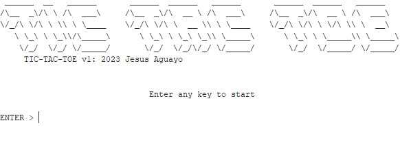
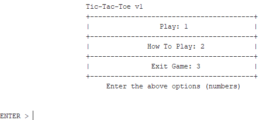
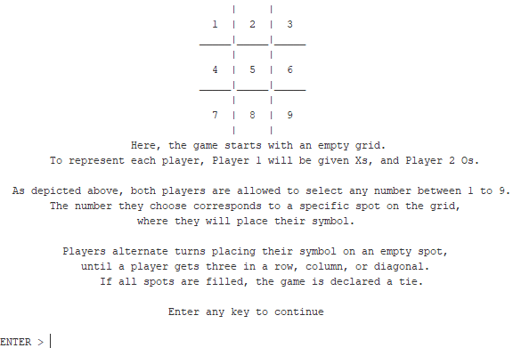
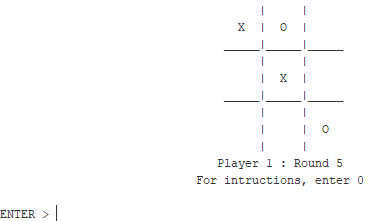

# TIC-TAC-TOE: MIPS Assembly
## Project Report
**What:**
In the MARS MIPS simulator, I created the classic game of TIC-TAC-TOE using MIPS Assembly.
**How:**
This game comprises four files: the main file, the game title, the main menu, and the game logic, each with its distinct components. These files have been designed to be modular and function cohesively as a unified system, rather than operating in isolation as individual components.
- The main file serves a straightforward purpose: it allows the user to launch and play the game, while also functioning as the central hub for the modular components.
- The game title is the most basic component. It serves as the initial screen that the player encounters, displaying the game's title and credits.

- The main menu is the player's second screen the player encounters with the game. It offers three options: play the game, access instructions on how to play, or exit the game. This component serves as the central hub, integrating all the other components and enabling the player to select their preferred option.

  1. Upon selecting the "play the game" option, the player will be directed to the main game screen, which we will delve into in further detail later on.
  2. Selecting the "how to play" option will lead the player to another screen, where they will find basic information on how to play Tic-Tac-Toe, including instructions on how to interact with the game board.
 

  3. Finally, selecting the "exit the game" option will terminate the program.
- The game logic is the player's third screen, where they can engage with the main game. In case the player requires assistance with the game controls, they can pause the game at any point by selecting the instructions option. Once they have reviewed the instructions, the game will resume from where it was paused.

To summarize, the game comprises four interdependent files that function as modules to create a unified gameplay experience. The main file displays the game title and credits and contains modules that other files utilize. The main menu serves as the central hub for the player to navigate and access other parts of the game. This file includes two functions, main_menu, and game_instructions, as previously outlined. The game logic is where the player can engage in the primary gameplay. It includes four functions: game_logic, which displays information from the other functions, print_board, modify_board, and check_board, all of which are self-explanatory. Upon winning or tying, the player will be returned to the main menu, where they can either choose to play again or exit the game.
